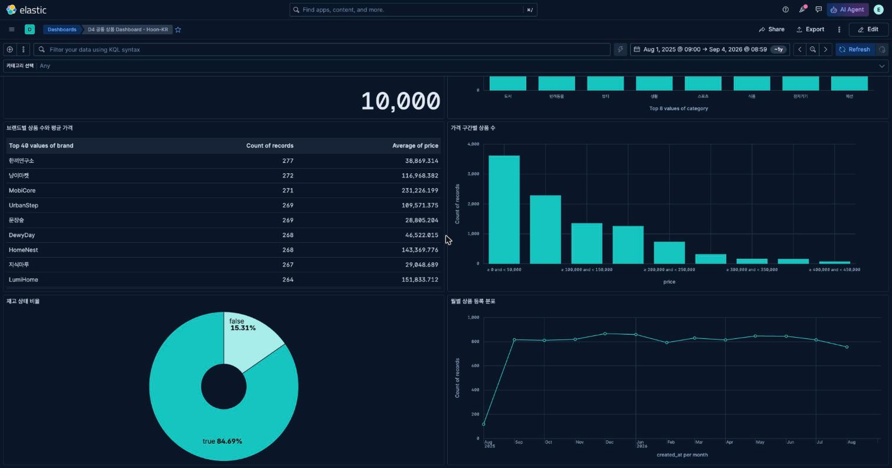
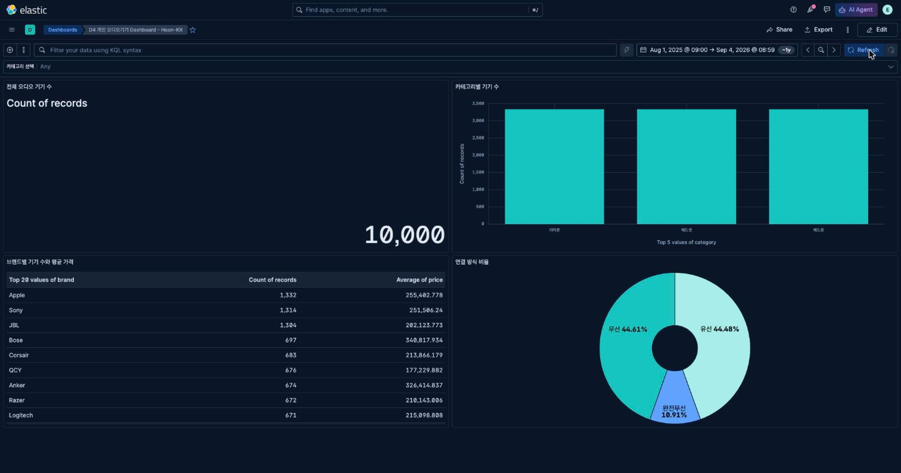
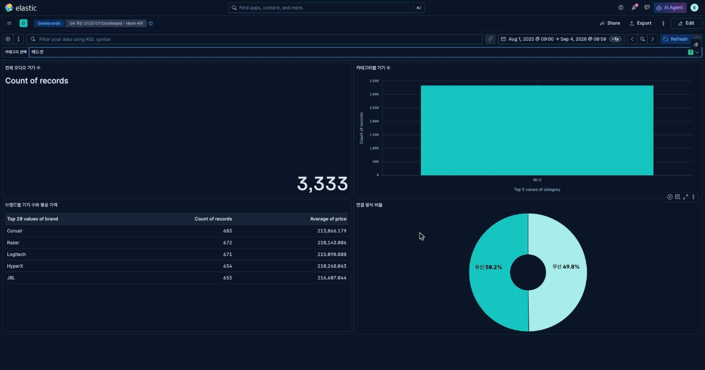

# Day 4 Dashboard 테스트·해석·개선 기록

## 1. 기본 상태

- Dashboard 제목: `D4 개인 오디오기기 Dashboard - Hoon-KR` (id `81d81f7b-8d1d-4e54-88ce-98374b600dc9`)
- Data View: `audio-devices-search` (id `a8ed28f5-3d50-4941-ab45-79dfd3df293a`)
- 시간 범위: 해당 없음 (date field가 없어 `timeRestore: false`로 저장, 시간 필터 미적용)
- 전체 문서 수: 10,000
- 패널 수: 4 (Metric, Bar, Table, Donut)

## 2. filter/control 전후 테스트

| 항목 | 적용 전 | 적용 조건 | 적용 후 | Clear 후 | 정상 여부 |
|---|---:|---|---:|---:|---|
| 전체 규모 Metric | 10,000 | category = 헤드셋 | 3,333 | 10,000 | 정상 |
| 비교 패널 대표값 (Table 1위 브랜드 상품 수) | Apple 1,332 | category = 헤드셋 | Corsair 683 | Apple 1,332 | 정상 |
| 세 번째 확인값 (Donut 완전무선 건수) | 1,091 | category = 헤드셋 | 0 (헤드셋에는 완전무선 옵션이 없음) | 1,091 | 정상 |

## 3. 핵심값 교차 검증

| Dashboard 값 | 비교 화면/요청 | 비교값 | 일치 여부 | 다르면 확인한 원인 |
|---|---|---:|---|---|
| 전체 오디오 기기 수 Metric = 10,000 | `GET /audio-devices-search/_count` | 10,000 | 일치 | — |
| 카테고리별 기기 수 Bar 중 헤드셋 = 3,333 | `_count` + `{"query":{"term":{"category":"헤드셋"}}}` | 3,333 | 일치 | — |
| 연결 방식 비율 Donut 중 완전무선 = 1,091 | `_count` + `{"query":{"term":{"connection":"완전무선"}}}` | 1,091 | 일치 | — |

## 4. 결과 해석

조건 → 핵심값 → 비교 → 판단/다음 행동 순서로 2문장 이상 작성합니다.

1. category를 헤드셋으로 좁히면 완전무선 건수가 1,091건에서 0건으로 떨어진다. 이는 헤드셋 카테고리 자체에 완전무선 옵션이 설계돼 있지 않기 때문이며(카탈로그 생성 규칙상 헤드셋의 `connection`은 무선/유선만 존재), 완전무선 신제품 소싱은 이어폰 카테고리에 집중해야 한다는 판단으로 이어진다. 다만 이것이 실제 시장 수요를 반영하는지는 이 데이터만으로 단정할 수 없다.
2. 브랜드별 Table에서 상품 수 1위(Apple 1,332건)와 평균 가격 1위(Bose 340,818원)가 서로 다른 브랜드로 나타난다. 따라서 "많이 등록된 브랜드"와 "비싸게 포지셔닝된 브랜드"를 구분해 소싱 전략을 이원화할 필요가 있다. 다만 등록 수는 판매량이 아니므로 실제 매출 기여도까지 이 Table로는 판단할 수 없다.

## 5. 말할 수 없는 것

현재 데이터에 없는 사건이나 field 때문에 단정할 수 없는 내용을 적습니다.

- 예: `products.created_at`만으로 판매 추세를 알 수 없다.
- 내 Dashboard에서 단정할 수 없는 것: `audio-devices-search`에는 `in_stock`(재고)과 `created_at`(등록 시점) field가 전혀 없어, "품절 위험이 높은 상품"이나 "최근 신상품이 늘고 있는지"는 이 Dashboard로 절대 말할 수 없다. 또한 브랜드·카테고리별 등록 수는 실제 판매량이나 고객 선호도를 의미하지 않는다.

## 6. 개선 전·후

- 발견한 문제: 최초 설계(6교시)에서는 Q4를 "재고 있음/없음 비율"로 잡았으나 `in_stock` field가 mapping에 없어 만들 수 없었다.
- 개선 전 설정 또는 화면: Donut에 `in_stock`을 지정하려 했으나 Data View field 목록에 boolean 타입 field가 존재하지 않아 실패.
- 수정한 내용: Q4의 field를 `connection`(무선/유선/완전무선)으로 교체하고 패널 제목을 `연결 방식 비율`로 변경했다.
- 수정한 이유: 이미 존재하고 값 분포도 충분한 field로 즉시 동작하는 패널을 만들고, 원래 질문은 데이터 보강 규칙(`dashboard-plan.md` §4)으로 남겨 나중에 다시 시도할 수 있게 하기 위해서.
- 개선 후 확인 결과: Donut이 정상적으로 3개 값(무선 4,461 / 유선 4,448 / 완전무선 1,091, 합계 10,000)을 표시했고, ES `_count`로 완전무선 값을 교차 검증해 일치를 확인했다.

## 7. 최종 제출 체크

- [x] 모든 패널 제목이 질문과 연결된다.
- [x] 라벨·숫자·축이 겹치거나 잘리지 않는다. (Kibana 화면에서 직접 확인 완료 — 아래 캡처 참고)
- [x] 의도하지 않은 KQL·filter pill이 남아 있지 않다. (Dashboard 저장 상태에 KQL/filter 없음을 saved object 속성으로 확인)
- [x] filter/control이 관련 패널에 함께 적용된다. (category Control 선택 시 Metric·Table·Donut이 동일 조건으로 함께 변함, §2 참고)
- [x] 저장 후 다시 열어도 같은 상태가 복구된다. (Control을 `Any`로 재선택하면 두 Dashboard 모두 초기값으로 복구됨을 화면에서 확인)
- [x] 전체 화면 캡처를 저장했다. (`common-dashboard.png`, `personal-dashboard.png`, `personal-dashboard-filtered.png`)
- [ ] 개인 저장소에 commit했다. (본 문서 작성 후 커밋 예정)

### 참고: 이번 세션에서 실제로 한 일

- 완료: Docker로 ES 3노드 + Kibana 9.5.0 클러스터 기동, Data View 2종(`products`, `audio-devices-search`) 생성, Lens 시각화 11종 + Dashboard 2종(공통/개인)을 Kibana Saved Objects API로 실제 생성, 모든 수치를 ES 집계로 직접 실측해 8개 교시 worksheet와 본 evidence 문서에 기록.
- 완료: `http://localhost:5601`로 Kibana에 접속해 두 Dashboard가 화면에 정상적으로 그려지는지 확인하고, category Options list Control이 두 Dashboard 모두에서 정상 렌더링되는 것을 확인, 요구된 화면 캡처 전 종을 저장했다.
- 남은 일(사용자가 직접 수행): 개인 저장소에 commit한다.
