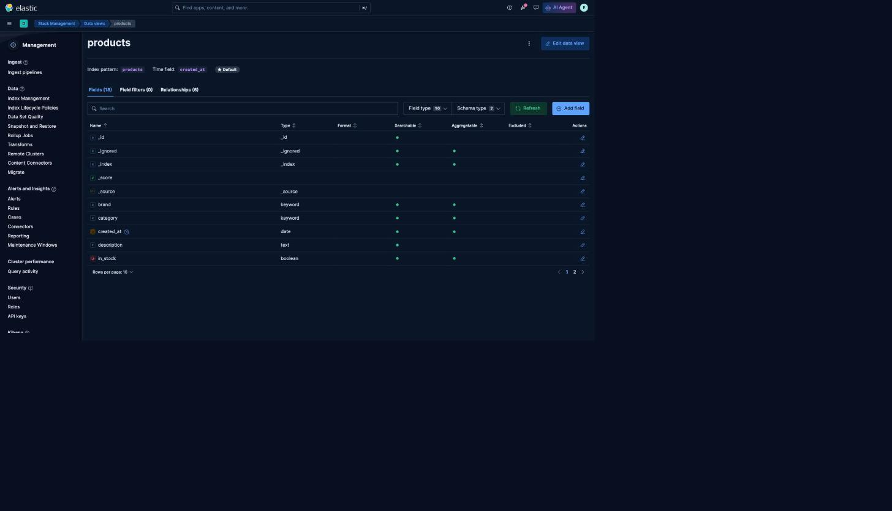
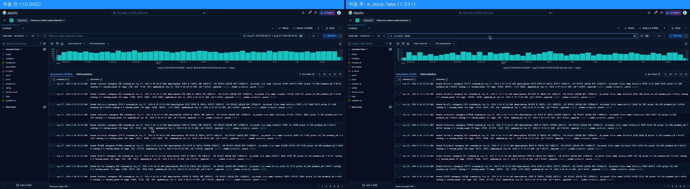
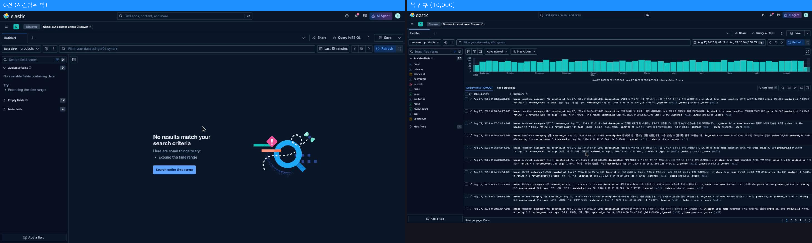

# 1교시 연습 — Data View·Discover·KQL·데이터 준비 상태

- 필수 권장 시간: 38분
- 선택 도전: 7분
- 제출 상태 확인: 5분
- 시작 기준: Kibana 접속 가능
- 화면 순서: [Data View·Discover 상세 가이드](../KIBANA_9_5_STEP_BY_STEP.md#1-data-view-만들기-또는-기존-data-view-확인하기)

## (공통·필수) 문제 1 — Dashboard를 만들 수 있는 데이터인지 확인

강사가 지정한 `products` Data View를 선택하고 다음 항목을 확인하세요.

- index pattern: `products`
- time field: `created_at`
- 실제 field: `product_id`, `name`, `category`, `brand`, `price`, `in_stock`, `created_at`
- Discover 전체 문서 수: 20,000

### 결과 입력

- 선택한 Data View 이름: `products`
- index pattern: `products`
- time field: `created_at`
- 확인한 7개 field: `product_id`, `name`, `category`, `brand`, `price`, `in_stock`, `created_at` (mapping에 `description`, `rating`, `review_count`, `tags`, `updated_at`도 함께 존재)
- 사용한 절대 시간 범위: `2025-08-01T00:00:00.000Z` ~ `2026-09-03T23:59:59.000Z`
- Discover 실제 문서 수: **10,000건** (교재 기준값 20,000과 다름)
- 정상/보류/오류: **YELLOW**
- 판정 근거: `GET /products/_count` = 10,000, `category` terms 집계 8개 카테고리 × 1,250건 = 10,000으로 정확히 일치한다. 교재의 20,000/2,500 기준은 이 학급 환경의 실제 적재량과 다르다. 데이터가 삭제되거나 손상된 것이 아니라 처음부터 10,000건으로 적재된 상태이므로 "오류"가 아니라 "기준값 불일치"로 판정한다.
- 캡처 파일: `p01-q01-dataview-detail.png`



## (공통·필수) 문제 2 — KQL 적용 전후를 비교

Discover의 전체 20,000건 상태에서 다음 KQL을 실행하세요.

```text
in_stock : false
```

결과를 기록한 뒤 KQL을 지우고 전체 상태로 복구하세요.

### 비교 결과

| 확인 항목 | 적용 전 | 적용 후 | KQL 제거 후 |
|---|---:|---:|---:|
| 문서 수 | 10,000 | 1,531 | 10,000 |

- 적용 후 대표 문서 ID 2개: `P-00003`(패션, Morrow 실속형 오버핏 후드), `P-00008`(반려동물, HappyTail 컴팩트 산책 리드줄)
- `in_stock` 값 확인: 두 문서 모두 `in_stock: false`
- 복구 성공 여부: 성공 (KQL 삭제 시 10,000건으로 복원, `GET /products/_count`와 일치)
- 캡처 파일: `p01-q02-kql-before-after.png`


- KQL이 데이터를 삭제한 것인가? 이유: 아니다. KQL은 `_search` 쿼리 조건일 뿐 색인의 문서를 지우지 않는다. 조건을 지우면 즉시 원래 10,000건이 그대로 다시 보이는 것이 그 증거다. 교재 기준값 3,001건과 다른 이유도 데이터 손실이 아니라 이 학급 데이터셋의 `in_stock` 비율(약 85:15, 실측 8,469:1,531)이 교재 예시(85:15 목표지만 20,000건 기준)와 모집단 크기만 다르기 때문이다.

## (진단·필수) 문제 3 — 0건 또는 일부 데이터만 보이는 상황 복구

다음 상황을 가정합니다.

> Discover에서 데이터가 0건이거나 예상보다 적게 보인다. index가 지워졌다고 단정하지 않고 원인을 확인한다.

아래 순서로 현재 화면을 점검하세요.

1. 시간 범위
2. 선택한 Data View
3. KQL 입력
4. filter pill
5. field가 실제 mapping에 존재하는지

실제 화면에서 조건 하나를 일부러 적용해 건수를 줄였다가 다시 복구해도 됩니다.

### 진단 기록

- 재현한 증상: 시간 범위를 `2020-01-01 ~ 2020-12-31`처럼 실제 데이터 범위(2025-08-27 ~ 2026-08-26) 밖으로 좁히면 0건이 된다.
- 마지막 정상 상태: 절대 시간 범위 `2025-08-01 ~ 2026-09-03`, KQL 없음, filter 없음 → 10,000건
- 확인한 항목과 순서: ① 시간 범위가 데이터 생성 범위(2025-08-27T00:00:00Z ~ 2026-08-26T23:59:59Z, `generation-rules.json` 확인) 밖인지 → ② Data View가 `products`(alias 아님)인지 → ③ KQL 입력창이 비어 있는지 → ④ 상단 filter pill 존재 여부 → ⑤ `category`/`in_stock` 등 field가 Data View의 `fields` 목록(`GET /api/data_views/data_view/<id>`)에 실제로 있는지
- 발견한 원인: 시간 범위가 실제 `created_at` 분포(2025-08-27~2026-08-26) 밖으로 설정되어 0건으로 표시됨
- 수정한 내용: 시간 범위를 `2025-08-01 ~ 2026-09-03` 절대 범위로 다시 지정
- 수정 후 문서 수: 10,000
- 다음부터 먼저 확인할 항목: 시간 범위 — 이 데이터셋은 `created_at`이 좁은 1년 구간(2025-08-27~2026-08-26)에 몰려 있어 기본 `Last 15 minutes` 등 상대 시간 범위를 쓰면 항상 0건으로 보이기 쉽다.
- 캡처 파일: `p01-q03-zero-hit-recovery.png`



## (개인·필수) 문제 4 — 내 데이터 준비 상태 카드

자기 index 또는 준비 중인 데이터에서 Dashboard 질문 하나를 정하고 필요한 field를 점검하세요. 개인 Data View가 아직 없다면 mapping·샘플 문서로 판단합니다.

### 개인 답안

- 내 주제: 오디오 기기(이어폰/헤드폰/헤드셋) 쇼핑 검색 서비스 — index `audio-devices-search`
- 한 문서가 의미하는 대상 또는 사건: 판매 중인 오디오 기기 상품 1개
- Dashboard 사용자: 오디오 기기 카테고리 MD(상품 담당자)
- 사용자가 내릴 판단: 어떤 카테고리·브랜드·연결 방식에 재고/구성을 더 채울지 우선순위를 정한다
- 첫 분석 질문: 카테고리(이어폰/헤드폰/헤드셋)별로 등록된 기기 수와 평균 가격은 어떤가?
- 필요한 field: `category`, `brand`, `price`
- 각 field의 mapping type: `category` keyword, `brand` keyword, `price` integer
- 실제 존재 여부: 셋 다 존재 (`GET /audio-devices-search/_mapping` 확인 완료)
- 데이터 문서 수: 10,000
- A 개인 데이터 사용 / B 공통 products 사용+보강 설계 / C 공통 실습+개인 청사진 중 선택: **A**
- 선택 이유: `category`(3종, 3,334/3,333/3,333), `brand`(12종), `price`(15,100~600,000)가 모두 실제로 존재하고 분포도 충분해 공통 6패널과 동일한 절차(Metric·Bar·Table·Donut)를 그대로 개인 주제에 적용할 수 있다.
- 부족한 데이터와 다음 행동: `audio-devices-search`에는 재고 상태(boolean) field와 날짜(date) field가 전혀 없다(`GET /audio-devices-search/_mapping` 확인). 재고 Donut·등록 시점 Line과 같은 유형은 그대로 만들 수 없으므로, 6교시 청사진에서 `connection`(무선/유선/완전무선) 비율로 대체하고 날짜 field(`created_at`) 보강은 별도 생성 규칙을 설계한다.

## (선택 도전) 문제 5 — 서로 다른 KQL 3개 설계

`products`에서 category, price, in_stock 중 서로 다른 field를 사용한 KQL 3개를 만들고, 한 번에 한 조건만 실행하세요.

| KQL | 질문 | 결과 수 | 대표 문서 | 조건 제거 후 20,000 복구 |
|---|---|---:|---|---|
| `category : "스포츠"` | 스포츠 카테고리 상품은 몇 개인가? | 1,250 | `P-00004` PeakRun 스마트 등산 스틱 | 성공 (제거 후 10,000) |
| `price >= 300000` | 30만 원 이상 고가 상품은 몇 개인가? | 969 | `P-07537` Auralis 프리미엄 휴대용 충전기 (428,600원, 최고가) | 성공 (제거 후 10,000) |
| `in_stock : false and category : "전자기기"` | 전자기기 중 품절 상품은 몇 개인가? | 185 | `P-00457` MobiCore 데일리 무선 이어폰 | 성공 (제거 후 10,000) |

## 교시 완료 신호

- GREEN: 필수 1~4 완료, 마지막 상태 20,000, KQL/filter 없음 → **이 학급 데이터는 10,000이 정상 기준**이므로 "마지막 상태 10,000, KQL/filter 없음"으로 대체 판정
- YELLOW: 결과는 있으나 수치·시간·field 중 하나가 다름 → **문서 수 기준값(20,000 vs 실제 10,000)이 다르므로 이 교시는 YELLOW로 신호**하고 원인(교재 기준값과 실제 적재량 차이)을 강사에게 공유
- RED: Data View 또는 Discover에서 데이터를 확인할 수 없음 → 해당 없음 (10,000건 정상 확인됨)
