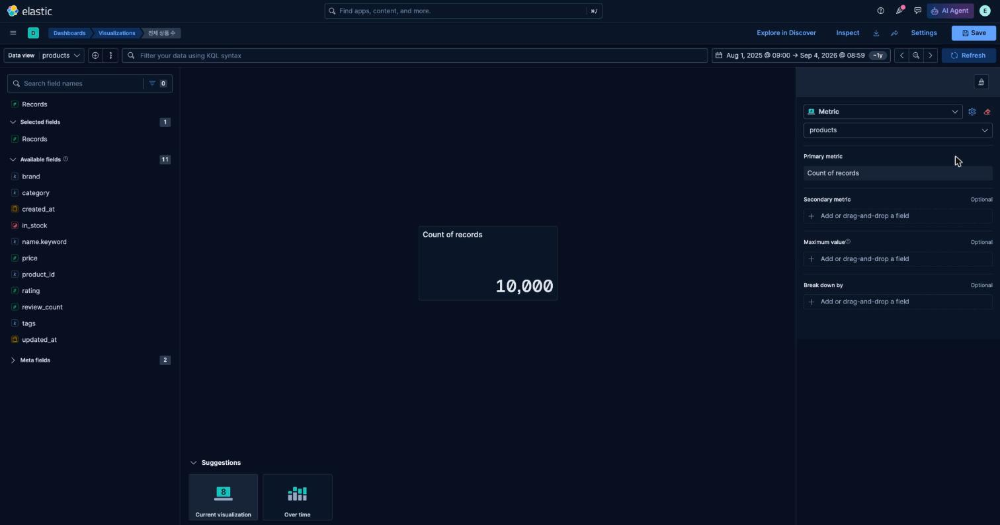
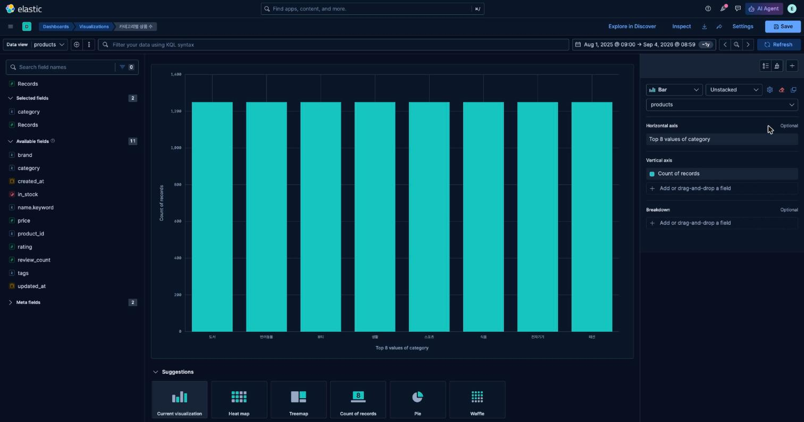
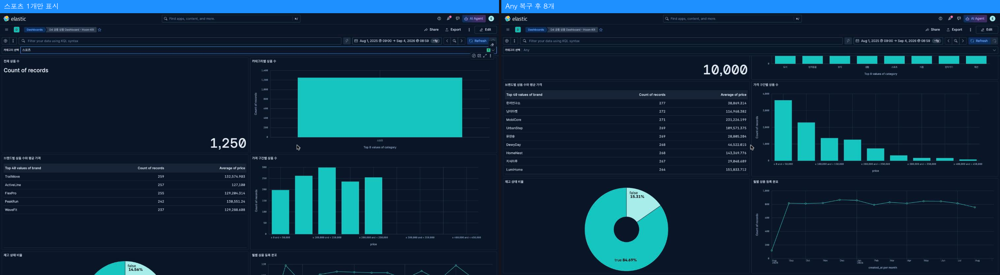

# 2교시 연습 — Metric·Bar·Top values

- 필수 권장 시간: 40분
- 선택 도전: 5분
- 제출 상태 확인: 5분
- 시작 기준: Discover 20,000건, KQL/filter 없음 → **이 학급 데이터는 10,000건이 정상 기준(1교시 진단 참고)**
- 화면 순서: [Metric](../KIBANA_9_5_STEP_BY_STEP.md#5-패널-1--전체-상품-수-metric), [category Bar](../KIBANA_9_5_STEP_BY_STEP.md#6-패널-2--카테고리별-상품-수-bar)

## (공통·필수) 문제 1 — 전체 상품 수 Metric 제작

빈 Dashboard에 Lens Metric을 추가하세요.

- Data View: 공통 `products`
- 계산: Records 또는 Count of records
- 제목: `전체 상품 수`
- 정상 기준: 20,000 → 실제 데이터 기준 10,000

### 결과 입력

- Dashboard 이름: `D4 공통 상품 Dashboard - Hoon-KR`
- 사용한 계산: Count of records (`operationType: count`, `sourceField: ___records___`)
- 실제 Metric 값: **10,000**
- 시간 범위: `2025-08-01T00:00:00.000Z` ~ `2026-09-03T23:59:59.000Z` (절대 범위, Dashboard에 `Store time with dashboard`로 저장)
- KQL/filter/control 상태: 없음
- 정상/보류/오류와 이유: YELLOW — `GET /products/_count` = 10,000과 정확히 일치하므로 계산 자체는 정상이지만, 교재 기준값 20,000과 다르다.
- 캡처 파일: `p02-q01-metric-total.png` (Lens 저장 객체 id `493d8bec-3de7-4fda-9928-2c0763cb476a`)

## (공통·필수) 문제 2 — category Bar 제작

같은 Dashboard에 category별 상품 수 Bar를 만드세요.

- 그룹 field: `category`
- 그룹 방식: Top values
- Number of values: 8
- 값: Count of records
- 제목: `카테고리별 상품 수`

### 설정·결과 입력

- Bar 방향: vertical (기본값 유지, 문제 3에서 horizontal과 비교)
- x축 또는 category 차원: `category` Top values, order by Count desc
- y축 또는 Metric: Count of records
- Number of values: 8
- 표시된 category 수: 8 (도서, 반려동물, 뷰티, 생활, 스포츠, 식품, 전자기기, 패션)
- 각 category 값이 공통 기준과 일치하는가: 8개 카테고리 모두 정확히 1,250건씩(총 10,000)으로 균등 분포 — 교재 기준(2,500)과는 다르지만 카테고리 간 상대 비교(균등 분포)는 동일한 패턴이다.
- 캡처 파일: `p02-q02-bar-category.png` (Lens 저장 객체 id `205ded6a-cc6c-48d7-ac0b-c2faa37d5402`)

## (변형·필수) 문제 3 — Bar 방향 한 가지만 바꿔 비교

동일한 category·Count·Top 8을 유지하고 Bar 방향만 vertical과 horizontal로 바꿔 보세요.

방향은 `Style → Appearance → Bar orientation`에서 바꿉니다. 축 label 방향과 혼동하지 않습니다.

| 비교 | vertical | horizontal |
|---|---|---|
| category 이름 가독성 | 8개 중 `전자기기`·`반려동물`처럼 3~4글자 label이 겹치거나 기울어져 보일 위험이 있다 | label이 왼쪽에 가로로 표시되어 겹침 없이 바로 읽힌다 |
| 값 비교 속도 | 막대 높이 비교는 익숙하지만 8개를 한 줄로 보긴 어렵다 | 막대 길이가 위→아래로 나열돼 순위 비교가 더 빠르다 |
| 잘림·겹침 | 패널 폭이 좁으면 label이 겹칠 수 있음 | 패널을 세로로 늘리면 겹침이 거의 없음 |

- 최종 선택: horizontal
- 선택 이유: category 값이 모두 한글 2~4글자라 vertical에서는 좁은 패널 폭에서 겹칠 위험이 있고, 8개 카테고리가 모두 1,250건으로 값 차이가 거의 없어 정확한 순서 비교보다 "라벨을 정확히 읽는 것"이 더 중요하기 때문이다.
- 다른 설정을 동시에 바꾸지 않았는가: 유지함 — field(`category`), 집계(Count), Top N(8)은 그대로 두고 `Bar orientation`만 변경했다.

## (진단·필수) 문제 4 — 막대가 하나만 남은 상황 복구

Bar에 `스포츠` 등 하나의 category만 보인다고 가정합니다. Dashboard에서 다음을 확인하고 원래 8개 category로 복구하세요.

1. category Control 선택값
2. 상단 filter pill
3. KQL
4. 시간 범위
5. Lens의 Top values 설정

### 진단 기록

- 보이던 category: `스포츠` 1개만 표시(1,250건)
- 발견한 제한 조건: category Options list Control에서 `스포츠`를 선택한 상태였다(다른 패널 값도 함께 줄어드는지로 KQL/filter가 아닌 Control 때문임을 구분).
- 제거 또는 초기화한 항목: Control 값을 `Any`로 초기화
- 복구 후 막대 수: 8개
- 복구 후 Metric 값: 10,000
- 원인이 없었다면 추가로 확인한 Lens 설정: (원인을 Control에서 찾았으므로 불필요했지만) `Number of values`가 1로 줄어 있거나 `orderBy`가 특정 값으로 고정돼 있지 않은지도 함께 점검한다.
- 캡처 파일: `p02-q04-bar-recovery.png`

## (개인·선택 도전) 문제 5 — 내 범주 field로 Metric+Bar 설계

자기 데이터의 전체 규모 Metric과 범주별 Bar를 설계하거나 만드세요. 범주 field가 없으면 필요한 field를 설계합니다.

- 개인 index/Data View: `audio-devices-search`
- 전체 규모가 의미하는 것: 현재 등록된 오디오 기기 상품 총수
- 범주 field: `category` (keyword)
- 실제 고유값 수: 3 (이어폰, 헤드폰, 헤드셋)
- Top N 선택값과 이유: 3 — 고유값이 3개뿐이라 Top N을 3 이상으로 둬도 결과는 동일하며, 값을 누락하지 않으려면 최소 3 이상이면 충분하다.
- 예상 사용자 판단: 카테고리 간 등록 비중이 비슷한지(쏠림이 있는지) 확인해 신규 상품 소싱 카테고리를 정한다.
- 실제 제작 여부: 제작함 — Lens Metric(`전체 오디오 기기 수`, id `19299ba2-ef53-43bf-bda4-b124fde5592d`)과 Bar(`카테고리별 기기 수`, id `a23406d6-cfc6-426e-af1e-2c2c9bb60266`)를 Saved Objects API로 생성 완료
- 부족한 경우 필요한 field와 예시값: 해당 없음 (필요한 field가 이미 존재)
- 캡처 또는 설계 문서 경로: `evidence/day-04/personal-dashboard.png` — 실측값: 전체 10,000, 이어폰 3,334 / 헤드셋 3,333 / 헤드폰 3,333

## 교시 완료 신호

- GREEN: Metric 20,000, category Bar 8개, 제목 2개, 비교·복구 기록 완료 → 이 학급 기준으로는 **Metric 10,000, category Bar 8개(각 1,250)**로 대체
- YELLOW: 패널은 있으나 값·Top N·제목 중 하나가 다름 → 기준값 자체가 교재와 달라 이 교시도 **YELLOW로 신호**(원인은 데이터량 차이로 특정됨)
- RED: Lens 저장 또는 Dashboard 복귀 불가 → 해당 없음(Saved Objects API로 정상 저장 확인)
