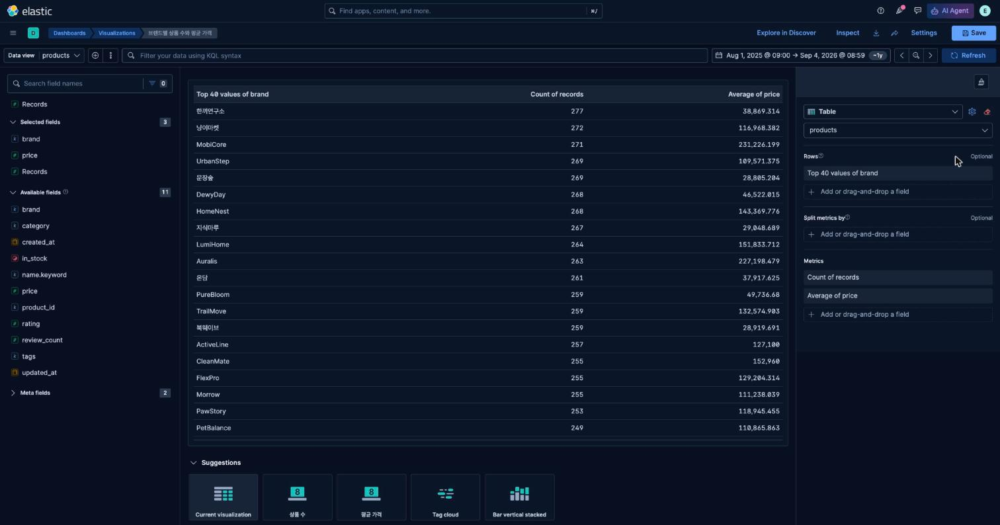

# 3교시 연습 — Table·Count·Average·정렬

- 필수 권장 시간: 40분
- 선택 도전: 5분
- 제출 상태 확인: 5분
- 시작 기준: 공통 Dashboard의 Metric과 category Bar 저장 완료
- 화면 순서: [Table 상세 가이드](../KIBANA_9_5_STEP_BY_STEP.md#7-패널-3--브랜드별-상품-수와-평균-가격-table)

## (공통·필수) 문제 1 — brand Table 제작

다음 세 열을 가진 Table을 만드세요.

1. `brand` Top values
2. Count of records
3. Average of `price`

Average는 `Metrics → Quick function → Average → Field: price`로 추가합니다. 열 Name은 `브랜드`, `상품 수`, `평균 가격`으로 지정합니다.

패널 제목은 `브랜드별 상품 수와 평균 가격`으로 저장합니다.

### 설정·결과 입력

- brand Number of values: 40 (실제 mapping의 고유 brand 수와 동일하게 설정해 전체 브랜드가 다 보이도록 함)
- 첫 번째 Metric과 label: Count of records → `상품 수`
- 두 번째 Metric과 label: Average of `price` → `평균 가격`
- 표시된 행 수: 40 (실제 고유 brand 수)
- 첫 3개 브랜드와 상품 수(Count 내림차순): 한끼연구소 277 / 냥이마켓 272 / MobiCore 271
- 첫 3개 브랜드의 평균 가격(위와 동일 정렬 기준): 한끼연구소 38,869 / 냥이마켓 116,968 / MobiCore 231,226
- 캡처 파일: `p03-q01-table-brand.png` (Lens 저장 객체 id `81d2c4b3-063b-4c51-8982-fd7068386cec`)

## (변형·필수) 문제 2 — 정렬 기준 하나만 바꿔 비교

Table의 나머지 설정을 유지하고 다음 두 정렬을 비교하세요.

- 설정 A: 상품 수 내림차순
- 설정 B: 평균 가격 내림차순

| 비교 | 설정 A | 설정 B |
|---|---|---|
| 첫 번째 브랜드 | 한끼연구소 | NeoTech |
| 첫 번째 상품 수 | 277 | 243 |
| 첫 번째 평균 가격 | 38,869원 | 232,804원 |

- 순서가 달라진 이유: `orderBy`를 `col_count`(상품 수)에서 `col_avgprice`(평균 가격)로 바꾸면 terms 집계의 정렬 키가 바뀌어 같은 40개 브랜드를 완전히 다른 기준으로 나열하기 때문이다. 상품 수가 많다고 평균 가격이 높은 것은 아니다(실제로 한끼연구소는 상품 수 1위지만 평균 가격은 38,869원으로 하위권).
- "상품이 많은 브랜드"에 맞는 정렬: 설정 A (상품 수 내림차순)
- "평균 가격이 높은 브랜드"에 맞는 정렬: 설정 B (평균 가격 내림차순)
- 최종 Dashboard에서 선택한 정렬과 이유: 설정 A(상품 수 내림차순) — 공통 Dashboard의 목적이 "브랜드별 상품 수" 비교(카탈로그 구성 파악)이므로 평균 가격은 보조 지표로 함께 보여주되 정렬 기준은 상품 수로 둔다.

## (진단·필수) 문제 3 — 평균만 보고 결론 내리는 오류 찾기

평균 가격이 높은 브랜드 하나를 선택하세요. 그 브랜드의 상품 수를 함께 확인하고 다음 질문에 답하세요.

- 선택한 브랜드: NeoTech
- 평균 가격: 232,804원
- 상품 수: 243개
- 평균 가격만 보면 내릴 수 있는 결론: "NeoTech가 전체 브랜드 중 가장 비싼 상품을 판다"고 성급히 결론 내릴 수 있다.
- 상품 수를 함께 보면 추가로 필요한 주의: 상품 수 243개는 40개 브랜드 중 하위권(평균 250개 내외)이라 표본이 작다. 특정 카테고리(예: 전자기기)에 몰려 있을 수도 있어 "브랜드 자체가 고가 포지셔닝"인지 "특정 고가 카테고리 상품만 등록돼 평균이 끌어올려진 것"인지는 이 Table만으로 구분할 수 없다.
- 현재 데이터로 말할 수 없는 것: 판매량, 실제 매출 기여도, 고객 만족도는 이 Table에 없으므로 "NeoTech가 매출을 가장 많이 낸다"고는 말할 수 없다.
- Count와 Average를 함께 보여 줘야 하는 이유: Average만 보면 표본 크기(신뢰도)를 알 수 없다. 상품 수가 매우 적은 브랜드는 평균이 극단값 하나에 크게 흔들릴 수 있으므로 두 지표를 함께 봐야 판단의 신뢰도를 가늠할 수 있다.

## (개인·필수) 문제 4 — 내 데이터의 정확한 값 비교 Table

자기 데이터에서 범주 field 하나와 숫자 field 하나를 선택해 Table을 설계하거나 만드세요.

- 사용자: 오디오 기기 카테고리 MD
- 분석 질문: 브랜드별로 등록된 기기 수와 평균 가격은 얼마나 차이 나는가?
- 행에 사용할 범주 field: `brand` (keyword, 고유값 12개)
- Metric 1과 이유: Count of records — 브랜드별 카탈로그 구성 비중을 보기 위해
- Metric 2와 이유: Average of `price` — 브랜드별 가격 포지셔닝(저가/프리미엄)을 함께 보기 위해
- Top N: 12 (전체 브랜드)
- 정렬 기준: 상품 수(Count) 내림차순
- 완료 기준: 12개 브랜드가 모두 표시되고 합계가 10,000과 맞는지 확인
- 실제 결과: 상품 수 상위 3개 — Apple 1,332건(평균 255,403원), Sony 1,314건(평균 251,506원), JBL 1,304건(평균 202,124원). 평균 가격 상위 3개 — Bose 697건(평균 340,818원), Sennheiser 662건(평균 328,344원), Anker 674건(평균 326,415원). 즉 상품 수가 많은 브랜드(Apple·Sony·JBL)와 평균 가격이 높은 브랜드(Bose·Sennheiser·Anker)가 서로 다르다 — 3교시 문제 2/3에서 확인한 패턴과 동일하다.
- 캡처/설계 문서 경로: `evidence/day-04/personal-dashboard.png` (Lens 저장 객체 id `87c0dc56-a8c4-4518-8746-ce6e2a65f64b`, 화면 캡처는 Kibana에서 직접)

## (선택 도전) 문제 5 — Table에 필요한 Metric 하나 추가

`rating` 또는 `review_count`처럼 실제 mapping에 있는 숫자 field 중 하나를 선택해 세 번째 Metric을 추가하고, 판단에 도움이 되는지 평가하세요.

- 추가한 field와 계산: `review_count`의 Average (products index)
- 추가 전 질문: 브랜드별 상품 수와 평균 가격만으로 인기도를 알 수 없었다.
- 추가 후 알 수 있는 것: 평균 리뷰 수를 더하면 "가격은 높지만 리뷰가 적은 브랜드(아직 검증이 덜 된 고가 브랜드)"와 "가격도 높고 리뷰도 많은 브랜드(검증된 프리미엄 브랜드)"를 구분할 단서가 생긴다.
- 표가 너무 복잡해졌는가: 3열에서 4열로 늘어난 정도라 아직 과하지 않다.
- 유지/제거 결정과 이유: 유지 — 다만 공통 Dashboard의 필수 패널 목적(브랜드별 규모·가격 비교)과는 별개이므로 공통 6패널에는 넣지 않고 개인 확장 패널 후보로만 기록한다.

## 교시 완료 신호

- GREEN: 3열 Table, 정렬 비교, 평균 해석, 개인 Table 설계 완료 — **충족**
- YELLOW: Table은 있으나 Average·정렬·label 중 하나가 미완료
- RED: Table에 brand 행 또는 price 평균을 표시할 수 없음
