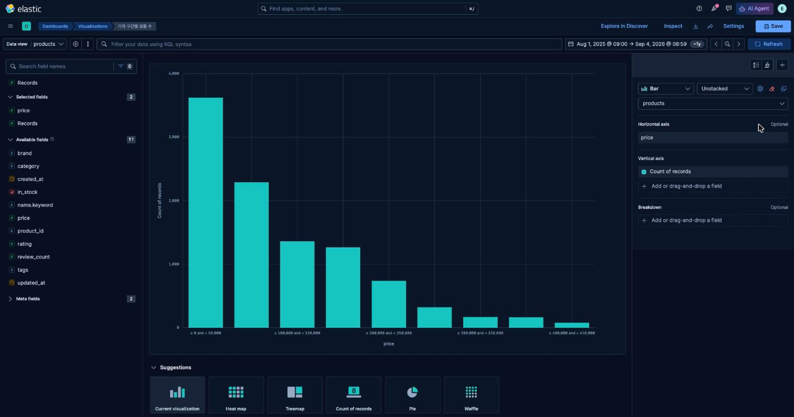
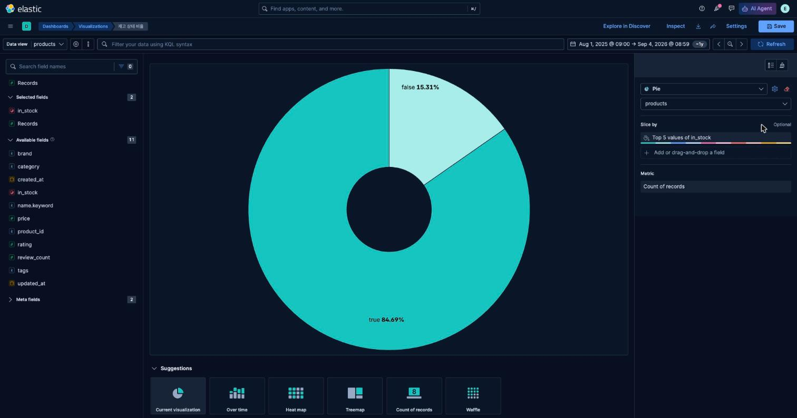
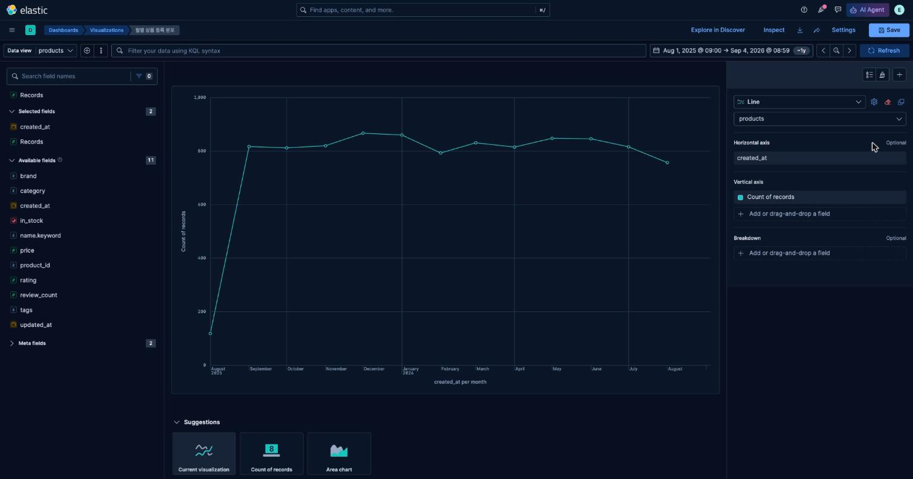

# 4교시 연습 — 가격 분포·재고 비율·등록 시점

- 필수 권장 시간: 42분
- 선택 도전: 3분
- 제출 상태 확인: 5분
- 시작 기준: 공통 Dashboard 3패널 저장 완료
- 화면 순서: [가격 구간](../KIBANA_9_5_STEP_BY_STEP.md#8-패널-4--가격-구간별-상품-수-bar), [Pie→Donut](../KIBANA_9_5_STEP_BY_STEP.md#9-패널-5--재고-상태-비율-donut), [Line](../KIBANA_9_5_STEP_BY_STEP.md#10-패널-6--월별-상품-등록-분포-line)

## (공통·필수) 문제 1 — 50,000원 단위 가격 분포

`price`와 Count of records를 사용해 가격대별 Bar를 만드세요. 자동 막대 수를 맞추려고 `Decrease granularity`를 반복하지 말고 `Create custom ranges`를 사용합니다.

### 결과 입력

- 실제 입력한 구간: `price` 실측 범위가 5,900~428,600원이므로 0~450,000원을 50,000원 단위 9구간으로 나눔 (0-50000, 50000-100000, …, 400000-450000)
- 구간 사이 빈틈·중복 확인 방법: `Create custom ranges`의 각 행 `from`을 이전 행 `to`와 동일하게 이어 붙이고(예: 두 번째 구간 from=50000은 첫 구간 to=50000과 일치), ES range 집계는 `[from, to)`로 하한 포함·상한 미포함이라 중복이 없음을 확인했다. 마지막 구간(400000-450000)이 실제 최대값 428,600을 포함하는지 `price` stats(`max: 428600`)로 재확인했다.
- 가장 많은 가격 구간: 0원 이상 50,000원 미만
- 해당 구간 실제 문서 수: 3,621건
- 제목: `가격 구간별 상품 수`
- 캡처 파일: `p04-q01-price-range-bar.png` (Lens 저장 객체 id `46a89e12-f0fb-407c-b61a-894235b3abfe`)

전체 9구간 실측: 0-5만 3,621 / 5-10만 2,289 / 10-15만 1,359 / 15-20만 1,264 / 20-25만 737 / 25-30만 321 / 30-35만 168 / 35-40만 163 / 40-45만 78 (합계 10,000)

## (공통·필수) 문제 2 — 재고 상태 Donut과 기준값 검증

차트 유형 `Pie`에서 `in_stock` Top values와 Count of records를 설정한 뒤, `Style → Appearance → Donut hole → Medium`으로 Donut을 만드세요. 차트 목록에서 Donut을 찾지 않습니다.

### 결과 입력

- true 실제 값: 8,469
- false 실제 값: 1,531
- 합계: 10,000
- 전체 20,000과 일치하는가: 아니오 — 전체 문서 수 자체가 교재 기준(20,000)이 아닌 10,000이므로 합계도 10,000과 일치한다(비율 true 84.69% / false 15.31%로 교재의 85%/15% 목표 비율과는 근접).
- 비율 또는 값 표시 방식: `Number display: Percent`로 표시하고 legend에 실제 값(8,469 / 1,531)을 함께 노출
- 제목: `재고 상태 비율`
- 한 조각만 보일 때 먼저 확인할 조건: category Control 선택값 → filter pill → KQL 순으로 확인(2교시 문제4와 동일한 절차)
- 캡처 파일: `p04-q02-donut-instock.png` (Lens 저장 객체 id `e120caf8-1b9d-4b4e-ae2e-de325d33bfaa`)

## (공통·필수) 문제 3 — 월별 상품 등록 Line과 잘못된 해석 수정

`created_at` Date histogram과 Count of records를 사용하고 `Minimum interval`에 `1M`을 입력해 월 단위 Line을 만드세요.

다음 문장을 데이터에 맞게 수정하세요.

> 월별 판매량이 증가하거나 감소하는 모습을 보여 준다.

### 결과 입력

- 선택한 interval: `1M` (월 단위 calendar interval)
- 보이는 월 구간: 2025-08 ~ 2026-08 (13개월, 2025-08은 8/27~8/31 5일치만 포함돼 131건으로 낮고 나머지 달은 745~872건으로 비교적 고르다)
- 실제 패널 제목: `월별 상품 등록 분포`
- 수정한 설명 문장: "월별 **상품 등록 건수**는 2025년 8월(131건, 월 마지막 5일만 포함)을 제외하면 매달 745~872건으로 큰 변동 없이 고르게 분포한다. 이는 판매량이 아니라 상품이 카탈로그에 등록된 시점의 분포다."
- `created_at`의 실제 의미: 상품이 시스템(카탈로그)에 등록된 시점 — 주문일·판매일이 아니다.
- 판매 추이를 알려면 추가로 필요한 사건/field: 주문(order) 이벤트와 `order_date`, 수량·매출 field가 있는 별도 index(예: orders)가 필요하다. 현재 `products` index에는 판매 관련 field가 전혀 없다.
- 캡처 파일: `p04-q03-line-created.png` (Lens 저장 객체 id `9de8147e-c477-4d44-b162-62390478e6ff`)

## (개인·필수) 문제 4 — 분포·비율·시간 중 하나 선택

자기 질문에 필요한 유형 하나만 선택해 설계하거나 만드세요.

| 선택 | 필요한 데이터 | 적합한 질문 예 |
|---|---|---|
| 분포 | 숫자 field | 값이 어느 구간에 몰려 있는가? |
| 비율 | 상태·범주 field | 상태별 구성은 어떠한가? |
| 시간 | 날짜 field | 기간별 문서 수는 어떻게 달라지는가? |

- 선택 유형: 비율 (audio-devices-search에는 boolean/date field가 없어 "분포"는 `price` custom ranges로, "비율"은 `connection`으로 대체 설계했다. 이번 답안은 실제로 만든 "비율" 유형을 기록한다.)
- 사용자 질문: 무선/유선/완전무선 연결 방식별 구성 비율은 어떤가?
- field와 mapping type: `connection` (keyword)
- 그룹/구간/시간 단위: Top values, size 5
- 차트: Pie → Donut hole Medium
- 완료 기준: 3개 값(무선/유선/완전무선)의 합이 10,000과 일치
- 실제 결과: 무선 4,461(44.6%) / 유선 4,448(44.5%) / 완전무선 1,091(10.9%), 합계 10,000
- 해석 시 주의할 한계: `in_stock`이나 `created_at` 같은 상태·시간 field가 없어 "재고 비율"이나 "등록 추이"는 이 index만으로 답할 수 없다. 6교시 `dashboard-plan.md`의 데이터 부족 분석에서 두 field 보강 규칙을 별도로 설계했다.

## (선택 도전) 문제 5 — 가격 구간 대안 비교

50,000원 구간과 자신이 설계한 다른 구간을 비교하세요. field와 Count는 유지합니다.

| 비교 | 50,000원 단위 | 대안 구간(자동 Intervals) |
|---|---|---|
| 막대 수 | 9개(고정) | granularity에 따라 가변(대략 10~20개, 정확한 개수 보장 안 됨) |
| 읽기 쉬움 | 구간 경계가 라운드 숫자라 읽기 쉬움 | 경계값이 어중간해(예: 47,622) 즉시 해석하기 어려움 |
| 판단에 유용함 | "50만 원 이하 저가군에 74%가 몰려 있다"처럼 바로 판단 가능 | 세밀하지만 구간 경계를 자동으로 재계산해 재현성이 낮음 |

- 최종 선택과 이유: 50,000원 단위 custom ranges — 재현 가능하고(같은 구간을 항상 만들 수 있음) 저가/중가/고가 구간 판단에 필요한 만큼의 해상도를 제공하기 때문이다.

## 교시 완료 신호

- GREEN: price Bar, stock Donut, created_at Line, 개인 유형 선택 완료 — **충족**
- YELLOW: 세 패널은 있으나 구간·값·시간 의미 중 하나가 다름
- RED: 숫자/상태/날짜 field를 Lens에 설정할 수 없음
