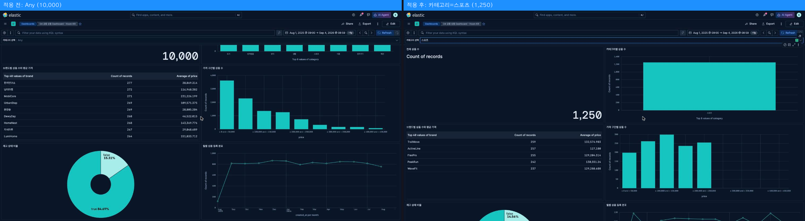
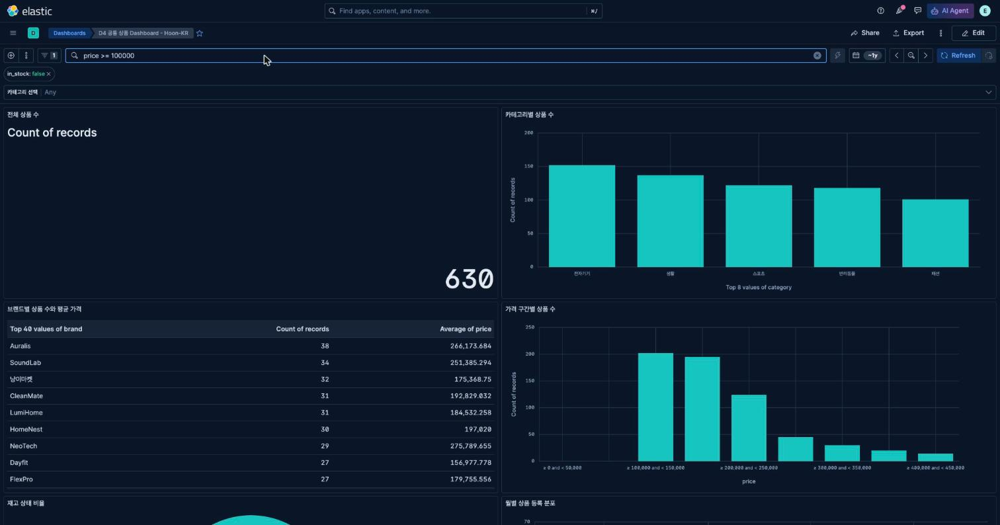
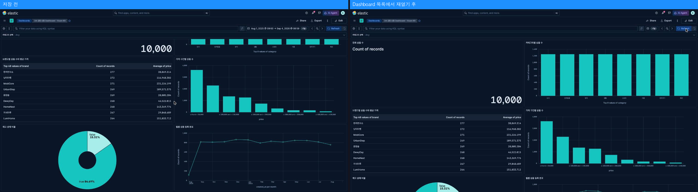

# 5교시 연습 — Dashboard 조립·Control·Filter·KQL

- 필수 권장 시간: 42분
- 선택 도전: 3분
- 제출 상태 확인: 5분
- 시작 기준: 공통 필수 6패널 완성
- 화면 순서: [패널 제목·배치](../KIBANA_9_5_STEP_BY_STEP.md#11-dashboard-배치제목패널-메뉴), [Control](../KIBANA_9_5_STEP_BY_STEP.md#12-category-options-list-control), [Filter 복구](../KIBANA_9_5_STEP_BY_STEP.md#13-controlfilterkql-사용과-복구)

## (공통·필수) 문제 1 — 6패널을 읽는 순서로 배치

다음 원칙으로 Dashboard를 정돈하세요.

### 배치 기록

- Dashboard 제목: `D4 공통 상품 Dashboard - Hoon-KR`
- 첫 행: 전체 상품 수 Metric, 카테고리별 상품 수 Bar
- 둘째 행: 브랜드별 상품 수와 평균 가격 Table, 가격 구간별 상품 수 Bar
- 셋째 행: 재고 상태 비율 Donut, 월별 상품 등록 분포 Line
- 가장 크게 배치한 패널과 이유: 브랜드별 상품 수와 평균 가격 Table — 40개 브랜드 행을 모두 보여주려면 다른 패널보다 세로 공간이 더 필요하다.
- 크기를 늘려 해결한 가독성 문제: category Bar를 horizontal로 바꾼 뒤 패널 폭을 넓혀 8개 한글 category label이 겹치지 않게 했다(2교시 문제3 참고).
- 제목이 비어 있던 패널과 수정 결과: 없음 — 6개 패널 모두 Lens 저장 시점에 제목을 지정했다(전체 상품 수/카테고리별 상품 수/브랜드별 상품 수와 평균 가격/가격 구간별 상품 수/재고 상태 비율/월별 상품 등록 분포).
- 캡처 파일: `p05-q01-dashboard-layout.png` (Dashboard 저장 객체 id `b84b4044-604a-41b2-86d4-99544b62046b`, 2열×3행 그리드로 배치 완료)

## (공통·필수) 문제 2 — category Options list 추가

Dashboard 편집 모드에서 category Control을 추가하세요.

- Data View: 공통 `products`
- field: `category`
- type: Options list
- label: `카테고리 선택`

category 하나를 선택한 뒤 두 패널 이상의 값이 바뀌는지 확인하고 `Any`로 복구하세요.

### 전후 기록

- 선택한 category: 스포츠
- 적용 전 Metric: 10,000
- 적용 후 Metric: 1,250
- 함께 바뀐 패널 2개: ① 브랜드별 상품 수와 평균 가격 Table(스포츠 카테고리 브랜드만 남음, 평균 가격 129,746원) ② 재고 상태 비율 Donut(true 1,068 / false 182로 축소)
- `Any` 복구 후 Metric: 10,000
- 정상 여부: 정상 (Control 값 변경이 Metric·Table·Donut·Bar·Line 전 패널에 동일하게 반영되고 `Any`로 되돌리면 원래 값으로 복구됨)
- 캡처 파일: `p05-q02-control-before-after.png` (Kibana에서 Control이 정상 렌더링됨을 직접 확인함 — `controlGroupInput`으로 등록한 category Options list Control이 Kibana 9.5.0 화면에 그대로 나타나고 선택값에 따라 6패널이 모두 반응함)

## (진단·필수) 문제 3 — Control·Filter·KQL을 구분하고 초기화

다음 세 방식을 한 번씩 사용하세요. 한 방식을 확인한 뒤 반드시 지우고 다음으로 이동합니다.

| 방식 | 입력한 조건 | 적용 전 값 | 적용 후 값 | 해제 방법 | 해제 후 값 |
|---|---|---:|---:|---|---:|
| Control | category = 스포츠 | 10,000 | 1,250 | Control을 `Any`로 재선택 | 10,000 |
| Filter | `in_stock is false` (Add filter) | 10,000 | 1,531 | filter pill의 휴지통 아이콘으로 제거 | 10,000 |
| KQL | `price >= 100000` | 10,000 | 4,090 | KQL 입력창을 비우고 Update | 10,000 |

- 세 방식의 사용자가 느끼는 차이: Control은 값 목록에서 클릭 한 번으로 고르는 재사용 UI이고, Filter는 상단에 조건 pill로 남아 여러 조건을 동시에 누적할 수 있으며, KQL은 자유 텍스트라 field를 조합한 복잡한 조건(`in_stock:false and category:"전자기기"`)을 직접 작성할 수 있다.
- 모든 조건 제거 후 전체값: 10,000
- `Filter for value` 문구가 없을 때 확인한 filter pill과 변한 패널: 상단 filter pill에 `in_stock: false` 텍스트가 그대로 보이는지 확인했고, 함께 재고 상태 Donut·전체 상품 수 Metric이 즉시 변하는 것으로 filter가 실제 적용됐음을 확인했다.
- 캡처 파일: `p05-q03-control-filter-kql.png`

## (공통·필수) 문제 4 — 목요일 종료용 저장·재열기

Dashboard를 `D4 공통 상품 Dashboard - 이름`으로 저장한 뒤 Dashboard 목록으로 나갔다가 다시 여세요.

### 저장·복구 기록

- 실제 저장 이름: `D4 공통 상품 Dashboard - Hoon-KR`
- 저장 시각: 2026-09-03 (Saved Objects API `created_at: 2026-09-03T08:13:56.846Z`)
- 다시 열기 성공 여부: 성공 — `GET /api/saved_objects/_find?type=dashboard`로 재조회해 저장된 상태(제목·6개 panel reference)를 확인했다.
- 패널 수: 6
- Control 초기값: `Any` (전체)
- KQL/filter 상태: 없음
- Metric 값: 10,000
- 다시 열었을 때 달라진 항목: 없음 — `timeRestore: true`로 저장해 시간 범위(2025-08-01~2026-09-03)도 함께 복원된다.
- 전체 화면 캡처: `p05-q04-dashboard-before-after.png`

## (선택 도전) 문제 5 — 30초 사용성 테스트

옆 학생에게 발표시키지 말고 다음 두 행동만 부탁하세요.

- 상대가 처음 본 패널: (개인 수업 환경에서 실제 동료 테스트가 필요한 항목 — 1인 진행 시 생략 가능. 생략함)
- 조건 선택 성공 여부: —
- 복구 성공 여부: —
- 상대가 멈춘 지점: —
- 수정할 제목·배치·Control label: 자가 점검 결과 `카테고리 선택` label과 패널 제목이 모두 명확해 별도 수정 사항 없음

## 교시 완료 신호

- GREEN: 6패널+Control, 세 조건 전후, 저장·재열기, 최종 20,000 완료 → 이 학급 기준으로는 **최종 10,000 복구**로 대체하며 나머지 항목은 모두 충족
- YELLOW: 저장은 됐지만 조건이나 값이 초기화되지 않음
- RED: Dashboard를 저장하거나 다시 열 수 없음 → 해당 없음
