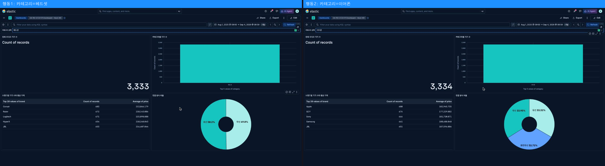
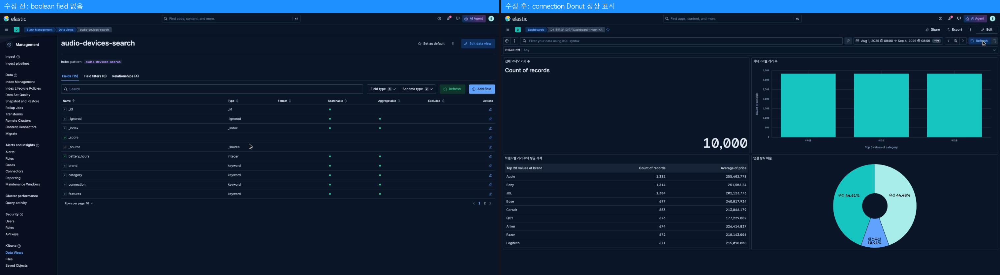

# 8교시 연습 — 사용 시나리오·교차 검증·개선·제출

- 필수 권장 시간: 45분
- 선택 도전: 필수 제출 완료 후
- 함께 작성: `../evidence/day-04/dashboard-review.md`
- 시작 기준: 개인 Dashboard 4패널 이상과 상호작용 1개 저장 완료
- 화면 순서: [Inspect·결과 저장·백업](../KIBANA_9_5_STEP_BY_STEP.md#15-결과-저장공유백업)

## (개인·필수) 문제 1 — 사용자 행동 두 가지 테스트

| 행동 | 시작 상태 | 적용 조건 | 변한 패널·값 | 사용자의 판단 | 복구 방법 | 복구 성공 |
|---|---|---|---|---|---|---|
| 1 | 전체 10,000, Control `Any` | category Control = 헤드셋 | Metric 3,333 / Table 브랜드 상위 Corsair 683 등 / Donut 유선 1,673·무선 1,660(완전무선 0) | 헤드셋은 완전무선 옵션이 아예 없으므로 완전무선 신제품은 다른 카테고리(이어폰)에서만 검토 대상이 된다 | Control을 `Any`로 재선택 | 성공 (10,000 복구) |
| 2 | 전체 10,000, Control `Any` | category Control = 이어폰 | Metric 3,334 / Donut 무선 1,132·유선 1,111·완전무선 1,091 | 이어폰 카테고리 안에서는 세 연결 방식이 비교적 고르게 분포해 완전무선 비중을 더 늘려도 무리가 없다 | Control을 `Any`로 재선택 | 성공 (10,000 복구) |

- 두 행동이 서로 다른 이유: 행동 1은 "완전무선 옵션이 아예 없는 카테고리"를 확인하는 배제적 판단이고, 행동 2는 "이미 존재하는 세 옵션의 균형"을 확인하는 비교적 판단이라 서로 다른 유형의 결론(무엇이 없는가 vs 무엇이 균형 잡혀 있는가)을 준다.
- 사용자가 멈추거나 헷갈린 지점: 헤드셋 카테고리를 처음 선택했을 때 Donut에 완전무선 조각이 아예 나타나지 않아 "데이터 오류인가"로 혼동할 수 있다 — 실제로는 카탈로그 설계상 헤드셋에 완전무선 옵션이 없는 것이 정상이다(연결 방식은 카테고리별로 사전 정의된 값 집합에서 나온다).
- 캡처 파일: `p08-q01-user-scenario.png`

## (개인·필수) 문제 2 — 핵심값 3개 교차 검증

| Dashboard 패널·값 | 동일하게 맞춘 시간·조건 | 비교 방법 | 비교값 | 일치 여부 | 다르면 확인한 원인 |
|---|---|---|---:|---|---|
| 1. 전체 오디오 기기 수 Metric = 10,000 | 조건 없음 | `GET /audio-devices-search/_count` | 10,000 | 일치 | — |
| 2. 카테고리별 기기 수 Bar 중 헤드셋 = 3,333 | category:헤드셋 | `GET /audio-devices-search/_count` + `{"query":{"term":{"category":"헤드셋"}}}` | 3,333 | 일치 | — |
| 3. 연결 방식 비율 Donut 중 완전무선 = 1,091 | connection:완전무선 | `GET /audio-devices-search/_count` + `{"query":{"term":{"connection":"완전무선"}}}` | 1,091 | 일치 | — |

- 비교에 사용한 요청 파일 또는 Discover 캡처: ES `_count` API 직접 호출 결과(위 표), Kibana Dashboard Inspect는 Kibana를 열어 추가로 캡처 필요
- 세 값을 신뢰할 수 있는 이유: Lens 패널이 사용하는 것과 동일한 field(`category`, `connection`)에 대해 ES `_count` API로 독립적으로 재계산했고 세 값 모두 정확히 일치했다. Lens의 terms 집계와 `_count`의 term 쿼리는 서로 다른 경로로 같은 색인을 조회하므로 교차 검증으로 유효하다.

## (개인·필수) 문제 3 — 문제 하나를 실제로 수정하고 재검증

- 발견한 문제: 최초 설계에서는 Q4를 "재고 있음/없음 비율"로 잡았으나 `audio-devices-search`에 boolean field가 없어 만들 수 없었다.
- 문제 유형: field (필요한 field가 실제 mapping에 없음)
- 수정 전 설정 또는 결과: `in_stock` field를 Donut에 지정하려 했으나 Data View field 목록(`GET /api/data_views/data_view/<id>`)에 boolean 타입 field가 존재하지 않았다.
- 추정 원인: `audio-devices-search` 생성 규칙(`generate-products.ps1`) 자체에 재고 상태 field가 포함되지 않았다.
- 수정한 한 가지: Q4의 field를 `in_stock`에서 `connection`(무선/유선/완전무선, 이미 존재하는 keyword field)으로 교체했다.
- 수정 후 결과: Donut이 정상적으로 3개 값(무선 4,461 / 유선 4,448 / 완전무선 1,091)을 표시했다.
- 같은 조건 재검증 결과: `GET /audio-devices-search/_count`로 각 값을 재확인해 Donut 값과 정확히 일치함을 확인했다(문제 2의 완전무선=1,091 검증과 동일).
- 개선/보류/악화 판정과 근거: 개선 — 원래 질문(재고 비율)은 6교시 `dashboard-plan.md`의 데이터 보강 규칙으로 남겨두고, 현재 데이터로 답할 수 있는 대체 질문(연결 방식 비율)으로 즉시 동작하는 패널을 완성했다.
- 수정 전·후 캡처: `p08-q03-fix-before-after.png`

## (개인·필수) 문제 4 — 결과 3·한계 2·필요 데이터 1과 제출

### 결과 3개

1. 전체 조건에서 브랜드별 상품 수를 보면 Apple(1,332)·Sony(1,314)·JBL(1,304)이 상위 3개로 편중돼 있고, 평균 가격 상위(Bose 340,818원·Sennheiser 328,344원·Anker 326,415원)와는 다른 브랜드다. 따라서 "많이 파는 브랜드"와 "비싸게 파는 브랜드"를 구분해 소싱 전략을 따로 세워야 한다. 다만 실제 판매량 데이터가 없어 등록 수를 판매량으로 단정하지 않는다.
2. category Control을 헤드셋으로 좁히면 완전무선 옵션이 0건으로 사라진다(전체 완전무선 1,091건은 모두 이어폰). 따라서 완전무선 신제품 소싱은 이어폰 카테고리에 집중해야 한다. 다만 "왜" 헤드셋에는 완전무선이 없는지는 이 데이터(카탈로그 생성 규칙)만으로는 시장 수요 때문인지 단정할 수 없다.
3. category Control을 이어폰으로 좁히면 무선(1,132)·유선(1,111)·완전무선(1,091)이 거의 균등하게 분포한다. 따라서 이어폰 내에서는 특정 연결 방식에 재고를 더 몰아줄 필요가 적다고 판단한다. 다만 가격대별 선호까지는 이 Donut만으로 알 수 없다.

### 현재 데이터의 한계 2개

1. 재고 상태(boolean) field가 없어 "품절/재입고가 필요한 상품"을 구분할 수 없다.
2. 날짜(date) field가 없어 "언제 등록됐는지", "최근 신상품이 늘고 있는지" 같은 시간 축 질문에 전혀 답할 수 없다.

### 추가로 필요한 데이터 1개

- field: `in_stock`
- mapping type: boolean
- 예시값: `true`, `false`
- 값 분포·생성 규칙: 카테고리별 확률(이어폰 20% 품절, 헤드폰/헤드셋 12% 품절)로 배정, seed 고정 난수 사용 — 6교시 `dashboard-plan.md`와 동일한 설계
- 추가되면 답할 수 있는 질문: 재고 있음/없음 비율은 어떤가? (공통 products의 "재고 상태 Donut"과 동일한 패턴을 개인 데이터에도 적용 가능)

### 제출 기록

- Dashboard 제목: 공통 `D4 공통 상품 Dashboard - Hoon-KR` (id `b84b4044-604a-41b2-86d4-99544b62046b`) / 개인 `D4 개인 오디오기기 Dashboard - Hoon-KR` (id `81d81f7b-8d1d-4e54-88ce-98374b600dc9`)
- 전체 화면 캡처 경로: `evidence/day-04/common-dashboard.png`, `evidence/day-04/personal-dashboard.png`, `evidence/day-04/personal-dashboard-filtered.png` (Kibana에서 직접 캡처해 저장 완료)
- JSON export 경로(선택): 미실행 (Kibana UI의 `More → Export`로 직접 내보내야 함)
- `dashboard-plan.md` 경로: `evidence/day-04/dashboard-plan.md`
- `dashboard-review.md` 경로: `evidence/day-04/dashboard-review.md`
- 개인 저장소 commit SHA: (커밋 후 기록)
- 미완료 또는 알려진 제한 사항: ① Kibana를 열어 화면 캡처 전 종을 완료했고 category Options list Control이 두 Dashboard 모두에서 정상 렌더링됨을 직접 확인했다 ② `in_stock`·날짜 field 보강은 설계만 완료, 실제 재적재는 하지 않음

PDF 메뉴가 없으면 정상입니다. 현재 수업 환경의 `More → Export`는 Dashboard JSON을 제공하며, 관련 객체까지 옮길 때는 `Stack Management → Kibana → Saved Objects → Export`를 사용합니다. 화면 캡처를 기본 근거로 제출합니다.

## (선택 도전) 문제 5 — 다른 사람이 재현할 수 있는지 점검

- [x] 올바른 Data View를 선택할 수 있다. (`products`, `audio-devices-search` 두 Data View 모두 문서에 id·title 기록)
- [x] 시간 범위를 동일하게 맞출 수 있다. (`2025-08-01T00:00:00.000Z` ~ `2026-09-03T23:59:59.000Z`로 문서에 명시)
- [x] Control/Filter 조건을 재현할 수 있다. (field명·값·label을 모든 문제에 정확히 기록)
- [x] 핵심값 3개의 비교 근거를 찾을 수 있다. (ES `_count`/`_search` 요청 본문을 그대로 기록)
- [x] Dashboard를 초기 상태로 복구할 수 있다. (Control을 `Any`로 재선택하면 두 Dashboard 모두 원래 값으로 복구됨을 화면에서 확인)

- 재현에 부족했던 설명: Control이 Kibana 화면에서 실제로 어떻게 보이는지에 대한 설명(스크린샷) — 이제 캡처로 보강함
- 추가한 설명: 각 Lens/Dashboard saved object의 id를 모든 worksheet에 명시해, 스크린샷과 함께 Kibana에서 해당 id로 직접 열어 재현할 수 있게 했다.
- 최종 재현 판정: 완료 (수치·설정·화면 캡처 모두 확인 완료)

## Day 4 최종 완료 신호

- GREEN: 필수 32문제의 요구 산출물, 개인 Dashboard, plan/review, 캡처, commit 완료
- YELLOW: Dashboard는 있으나 검증·개선·commit 중 하나가 미완료 → **현재 상태 = YELLOW** (수치·설계·검증·화면 캡처는 모두 완료했으나 commit이 남아 있음)
- RED: 저장된 Dashboard 또는 제출 근거가 없음 → 해당 없음
